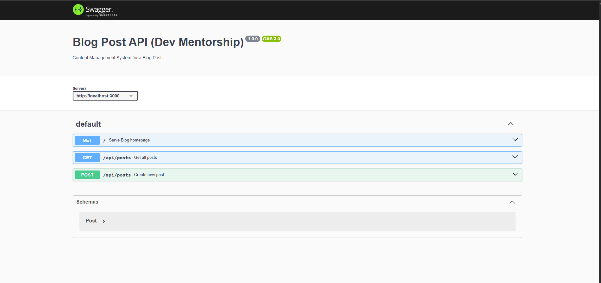

# API Design Thinking

## Overview - Specification
This API design is used for a blog Post System which  allows client to create,Delete and retrieve users, create and manage post, create comments and Delete comments.

## Resources => CRUD Operations

### - Users => Create/Delete User, PUT/Update User 

### - Posts => Create/Delete Post, PUT/Update post, Get Post

### - Comments => Create/Delete Comment, GET Comment

## API URL Structure 

### - Users => 

``` 
POST /api/signup
GET /api/users
GET /api/users/:id
GET /api/users/:id/post

```
### - Post
```
POST /api/posts
DELETE /api/posts/:id
GET /api/posts/:id
```
### - Comments
```
POST /api/comments
GET /api/comments/:id
DELETE /api/comments/:id 
```



